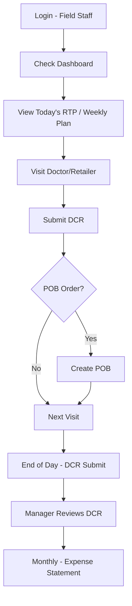
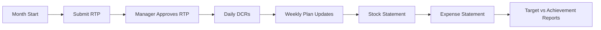

# Platform Overview — Synchem Salestrip SFA

> **Build target:** Multi-tenant **Pharma SFA SaaS** — Synchem (`SYN`) is the first tenant. See **[17-FINAL-BUILD-PLAN.md](./17-FINAL-BUILD-PLAN.md)**.

## What Is Salestrip?

**Salestrip** is a **Sales Force Automation (SFA)** platform built for pharmaceutical and FMCG companies. The Synchem instance (`synchem.salestrip.in`) is configured for **Synchem Pharmaceuticals Pvt. Ltd.** — a pharma company based in Indore, India.

The platform digitizes the entire field force workflow:

```
Master Data → Planning → Field Execution → Approvals → Reporting
```

## Business Domain

### Primary Users

| User | Hindi/Industry Term | What They Do |
|------|---------------------|--------------|
| **Medical Representative (MR)** | Field Staff (FS) | Visit doctors/chemists, detail products, take orders, submit DCR |
| **Area Manager / RM / ZM** | Manager (MAN) | Approve plans, monitor team, joint field work |
| **Admin / HO Staff** | Admin (AD) | Manage masters, configs, company-wide reports |

### Core Business Objects

| Object | Description |
|--------|-------------|
| **Doctor (HCP)** | Healthcare professional — primary call point |
| **Retailer (Chemist)** | Pharmacy — POB and stock collection point |
| **Stockist** | Distributor — secondary sales data source |
| **Product (SKU)** | Pharmaceutical product with brand, division, dosage |
| **HeadQuarter (HQ)** | Sales territory unit |
| **Route (Beat)** | Sub-territory within HQ — collection of doctors/retailers |
| **Employee** | System user mapped to HQ, hierarchy, role |

## Module Map (7 Top-Level Modules)

### 1. Dashboard
Role-specific home screens with KPIs, pending tasks, calendars.

### 2. Master Setup (35 features)
All reference data: geography, products, people, customers.

### 3. Transaction (20 features)
Daily operations — the heart of the SFA system.

| Transaction | Full Name | Purpose |
|-------------|-----------|---------|
| **RTP** | Route Tour Programme | Monthly plan of which routes to visit each day |
| **DCR** | Daily Call Report | Log of actual visits, detailing, samples, expenses |
| **POB** | Personal Order Booking | Orders taken from doctors/retailers |
| **Weekly Plan** | Weekly Doctor Call Plan | Week-wise doctor visit schedule |
| **Stock Statement** | Monthly stock/sales survey | Secondary sales data from market |
| **Expense Statement** | Monthly expense claim | Travel and daily expense reimbursement |
| **Gift/Sample** | Promotional material flow | Requisition → Receive → Allocate → Distribute |

### 4. Reports (60 features)
Analytics across visits, sales, expenses, targets, territory.

### 5. Admin (3 features)
Roles, permissions, leave accrual.

### 6. Setting (3 features)
DCR rules, company info, leave policy.

### 7. Approval (15 features)
Workflow queues for manager/admin sign-off.

## Typical Field Force Day (Workflow)



## Monthly Cycle



## Key Integrations

| Integration | Usage |
|-------------|-------|
| **Google Maps** | Route mapping, current location, geo-fencing |
| **Firebase Push** | Mobile push notifications (`PushToken` on employee) |
| **Mobile App** | Android SFA app (version 1.2.54 observed) |
| **SMS/Email** | OTP, password reset, notifications |

## Company Configuration (Synchem)

| Setting | Value |
|---------|-------|
| Company Code | `SYN` |
| Company Name | Synchem Pharmaceuticals Pvt. Ltd. |
| Division | Ethical |
| Timezone | Asia/Kolkata |
| Locale | en-IN |
| Date Format | DD/MM/YYYY |

## Screens Not in Main Menu (Also Clone)

These routes exist in the application code but may be accessed differently:

- Bulk uploads (7 types)
- E-Detailing
- Internal mail (inbox, compose, draft, sent)
- Product price updation
- Login history report
- Location tracking / check-in history

See [modules/additional-features/](./modules/additional-features/) and [modules/bulk-upload/](./modules/bulk-upload/).
