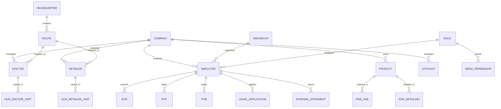

# Data Model & Core Entities

## Entity Relationship Overview



## Core Entities

### 1. Company (Tenant)

| Field | Example | Notes |
|-------|---------|-------|
| compCode | `SYN` | Primary tenant key |
| compName | Synchem Pharmaceuticals Pvt. Ltd. | |
| compAddress | 38, S.R. Compound, Dewas Naka, Indore | |
| industryType | `SYN` | Pharma |
| companyLogo | Documents/SYN/Logo_Syn.jpg | |

### 2. Employee

Key fields from `employeeObj`:

| Field | Type | Description |
|-------|------|-------------|
| EmpId | int | Primary key |
| UserName | string | Login username |
| FirstName, LastName | string | Name |
| EmailId | string | |
| MobileNo | string | |
| EmployeeCode | string | e.g. `0002` |
| RoleId | int | FK to Role |
| RoleType | string | AD / MAN / FS |
| RoleName | string | ADMIN, MR, etc. |
| HierachyId | int | FK to Hierarchy |
| HierachyCode | string | e.g. `ADMIN` |
| HierachyType | string | MGT / MR / etc. |
| HeadQuaterId | int | FK to HQ |
| HeadQuaterName | string | e.g. `H. Office` |
| ReportingManager | int | FK to Employee |
| Division | string | e.g. `1` (Ethical) |
| CityId, StateId | int | Location |
| QualificationId | int | |
| Active | bool | |
| IsFirstLogin | bool | Force password change |
| IsCheckIn | bool | GPS check-in enabled |
| IsGeoFencingApplicable | bool | |
| expenseTemplateData | object | Assigned expense template |
| LastDCRDate | datetime | Last DCR submission |
| MobileAppVersionInUse | string | e.g. `1.2.54` |
| PushToken | string | Firebase token |

**Common audit fields on all entities:** `EntryBy`, `UpdateBy`, `DeleteBy`, `CompKey`, `Mode`

### 3. Hierarchy

Organizational tree for reporting structure.

| Field | Description |
|-------|-------------|
| HierachyId | PK |
| HierachyCode | e.g. ADMIN, RM, ZM, MR |
| HierachyType | MGT, SAL, etc. |
| HierachyLevel | Numeric level |
| ReportingHierachy | Parent hierarchy |

APIs: `users/hierarchy-chart/`, `hierachy/reporting/`

### 4. HeadQuarter (HQ)

| Field | Description |
|-------|-------------|
| HeadQuaterId | PK |
| HeadQuaterName | Territory name |
| StateId | State mapping |
| HeadQuaterType | HQ classification |
| Active | Status |

APIs: `headquater/active`, `headquater/bulkUpload`, `headquater/employeeWise/`

### 5. Route (Beat)

| Field | Description |
|-------|-------------|
| RouteId | PK |
| RouteName | Beat name |
| HeadQuaterId | FK |
| StateId | FK |
| DoctorCount | Computed |
| RetailerCount | Computed |

APIs: `route/routeListAll`, `route/withDoctorRetailerCount`, `route/bulkUpload`

### 6. Doctor (HCP)

| Field | Description |
|-------|-------------|
| DoctorId | PK |
| DoctorName | |
| SpecialistId | FK |
| QualificationId | FK |
| RouteId | FK |
| HeadQuaterId | FK |
| VisitFrequency | Planned visits/month |
| PreferredDay | Visit day preference |
| Active | Status |
| ProductLinks | Products detailed |

APIs: `doctor/doctor-list`, `doctor/all/`, `doctor/mrLinking`, `doctor/bulkUpload`

### 7. Retailer (Chemist)

| Field | Description |
|-------|-------------|
| RetailerId | PK |
| RetailerName | |
| RouteId | FK |
| HeadQuaterId | FK |
| Contact details | Phone, address |
| Active | Status |

APIs: `retailer/retailer-list/`, `retailer/bulkUpload`, `retailer/employeeWise`

### 8. Stockist

| Field | Description |
|-------|-------------|
| StockistId | PK |
| StockistName | |
| HeadQuarterId | FK |
| Contact | |

APIs: `stockist/stockist-list/`, `stockist/bulkUpload`

### 9. Product

| Field | Description |
|-------|-------------|
| ProductId | PK |
| ProductName | |
| BrandId | FK |
| DivisionId | FK |
| CategoryId | FK |
| DosageId | FK |
| PackingTypeId | FK |
| Price | MRP/PTS |
| Active | |

APIs: `product/`, `product/divisionWise/`, `product/bulkUpload`

### 10. DCR (Daily Call Report)

The most complex transaction entity.

| Sub-entity | Description |
|------------|-------------|
| DCR Header | Date, employee, work type, transport |
| Doctor Visits | Doctors met, products detailed, samples given |
| Retailer Visits | Retailers met, stock checked |
| CRM Activities | Non-call activities |
| Daily Expenses | Travel, food expenses |
| Linked POB | Orders from visits |

APIs: `dcr/list/`, `dcr/doctor`, `dcr/retailer-stockist`, `dcr/dcr-approval`, `dcr/summarize-data/`

### 11. RTP (Route Tour Programme)

| Field | Description |
|-------|-------------|
| RTPId | PK |
| EmpId | FK |
| Month/Year | Period |
| Daily routes | Calendar mapping |
| Status | Draft/Submitted/Approved |

APIs: `monthly-rtp/emp/`, `monthly-rtp/status`, `monthly-rtp/pending`

### 12. POB (Personal Order Booking)

| Field | Description |
|-------|-------------|
| POBId | PK |
| PartyType | Doctor/Retailer |
| PartyId | FK |
| Products | Line items with qty |
| Date | |

APIs: `pob/partyData/`, `pob/doctor-retailer/`, `pob/number`

### 13. Role & Menu Permission

| Field | Description |
|-------|-------------|
| RoleId | PK |
| RoleName | |
| MenuId | FK |
| CanView/Add/Edit/Delete/Preview/Print | bool flags |

API: `role-menu-permissions/`

## Status Workflow Pattern

Most transactions follow:

```
Draft → Submitted → Pending Approval → Approved/Rejected → Locked
```

Unlock requests allow editing locked records (with approval).

## Clone Database Recommendations

1. Use `comp_code` column on every table for multi-tenancy
2. Soft delete with `active` flag + `delete_by`/`delete_at`
3. Audit columns on all tables
4. Status enum tables for workflow states
5. Notification table linked to pending approvals
6. Document/attachment table for file uploads
