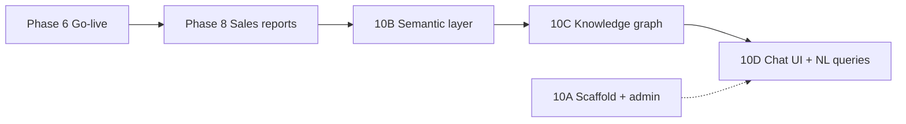

# Clone Roadmap — Implementation Phases

> **⭐ START HERE for build decisions:** [17-FINAL-BUILD-PLAN.md](./17-FINAL-BUILD-PLAN.md) — locked stack, multi-tenant SaaS, 500 users in 6 months, Docker, monorepo.

This document covers **detailed phase breakdown**. Two tracks:

| Track | Timeline | Goal |
|-------|----------|------|
| **A — MVP Go-Live** | **6 months** | 500 users, core SFA + mobile offline |
| **B — Full Parity** | 9–10 months | All 152 screens, 327 APIs |

---

## Track A — MVP Go-Live (6 Months, 500 Users)

### Scale targets

| Milestone | Users | Notes |
|-----------|-------|-------|
| Day 1 | 20–40 | Synchem (`SYN`) first tenant |
| Month 3 | 10–20 | Internal test + mobile offline |
| Month 4 | 40–50 | Pilot MRs |
| Month 5 | 100–200 | Beta |
| **Month 6** | **500** | Production go-live |

### Phase 0 — Foundation (Month 1)

- [ ] Monorepo scaffold (`apps/api`, `web`, `mobile`, `worker`, `packages/shared-types`)
- [ ] Docker Compose (Postgres, Redis, API, worker)
- [ ] GitHub Actions CI (lint, test, Docker build)
- [ ] Prisma schema v1 + migrations
- [ ] Auth: `/token` endpoint, JWT, refresh tokens
- [x] **Multi-tenant:** `companies` table, `compCode` middleware, tenant settings
- [x] **Platform super admin** + tenant admin roles
- [x] RBAC **engine**: roles, menus, `@RequirePermission` guard, login `menuList` (per tenant)
- [ ] RBAC **admin UI**: Role Master + Role Setting — see [Phase 1.5](./22-ROLE-ACCESS-CONFIG-PLAN.md)
- [x] React: login + sidebar shell (role-based menus from login)
- [ ] OpenAPI v1 skeleton

**Deliverable:** Login works, tenant isolation verified, sidebar renders.

### Phase 1 — Master Data (Month 2)

Priority P0 masters — see [modules/master-setup/](./modules/master-setup/)

| # | Master |
|---|--------|
| 1 | Hierarchy, Employee |
| 2 | City, HeadQuarter, Route |
| 3 | Product, Brand, Division |
| 4 | Doctor, Retailer, Stockist |
| 5 | Key LOVs (designation, specialist, dosage, etc.) |
| 6 | Bulk upload (7 types) |

**Deliverable:** Admin can set up full master data for Synchem.

### Phase 1.5 — Role & Access Configuration (Month 2–3)

> **Full spec:** [22-ROLE-ACCESS-CONFIG-PLAN.md](./22-ROLE-ACCESS-CONFIG-PLAN.md) — **complete**.

| Sub-phase | Deliverable | Status |
|-----------|-------------|--------|
| **1.5A** | Role Master (`ADM01`) — CRUD roles | Done |
| **1.5B** | Role Setting (`ADM04`) — menu permission matrix + bulk save API | Done |
| **1.5C** | Web `usePermission` hook — hide buttons by `canAdd` / `canEdit` / … | Done |
| **1.5D** | Route guard + mobile dashboard feature gating | Done |
| **1.5E** | Default AD/MAN/FS permission templates in seed + i18n + tests | Done |

**Deliverable:** Admin opens `/app/roleSetting`, checks/unchecks menus for MR role → MR login sees only allowed features. ✅

### Phase 2 — Core Transactions Web (Month 3)

| # | Transaction | Priority | Status |
|---|-------------|----------|--------|
| 1 | Tour Programme (RTP) | P0 | Done |
| 2 | Daily Call Report (DCR) | P0 | Done |
| 3 | Weekly Plan | P0 | Done |
| 4 | Personal Order Booking (POB) | P0 | Done |

**Deliverable:** MR can plan and submit DCR on web (online). ✅

### Phase 3 — Mobile MVP (Month 3–4, parallel Phase 2)

**Stack:** React Native + Expo + WatermelonDB — see [15-mobile-stack.md](./15-mobile-stack.md)

- [x] Mobile login (EMPLOYEE + compCode) + MPIN
- [x] Field Staff Dashboard
- [x] **Offline DCR** + delta sync API
- [x] GPS check-in (`expo-location`)
- [x] Biometric MPIN unlock
- [x] Auto-sync on foreground
- [x] Mobile RTP read view
- [x] Expo push token registration (API)
- [x] Firebase push delivery (approval pending) — **MVP Done** (API + FCM adapter; mobile SDK pending)
- [ ] Load test: 100 concurrent syncs

**Deliverable:** MR submits DCR offline from mobile — **critical for 500 users**. ✅ (MVP + polish)

### Phase 4 — Approvals & Manager (Month 4–5)

Minimum approval queues for go-live:

- [x] DCR Approval
- [x] Tour Programme Approval
- [x] Weekly Plan Approval
- [x] Leave Approval *(basic — **P3 low**; no further leave work until MR journey + sales P0 done)*
- [x] Expense Approval
- [x] Doctor Approval (`MAS10` + `MAS11`)
- [ ] Retailer Approval
- [x] Manager Dashboard (pending counts + sales KPIs)
- [x] Push notifications — **MVP Done** (FCM when `FIREBASE_SERVER_KEY` set)

> **Current product focus:** [24-MR-JOURNEY-SALES-PRIORITIES.md](./24-MR-JOURNEY-SALES-PRIORITIES.md) — MR field journey + sales reports **before** leave/HR polish.

**Deliverable:** Full submit → approve loop works for **DCR, RTP, Weekly, POB**.

### Phase 5 — Monthly Cycle + Reports (Month 5)

| Module | Priority | Status |
|--------|----------|--------|
| **MR journey txn** (DCR, RTP, Weekly, POB) + mobile sync | **P0** | **Done** — UAT |
| **Sales reports** (POB, sales summary, target, visits) | **P0** | **Done** — 12 MVP reports |
| Expense statement + approval | P1 | **Done** (polished UI + detail views) |
| Doctor creation + approval (`MAS10` / `MAS11`) | P1 | **Done** |
| Leave application + policy + approval | **P3 (Low)** | MVP API done — **defer** mobile, UI polish, advanced rules |
| Stock statement (basic) | Deferred | |
| Gift/Sample (basic) | Deferred | |
| Key reports (12 of 12 MVP) | P0/P1 | **Done** |
| Full report suite + Excel | P1 | **Done** — CSV export on MVP reports |

**Deliverable:** MR can complete daily field work + managers see sales/coverage KPIs. Leave/expense = minimal only.

### Phase 6 — Go-Live (Month 6)

- [ ] Staging UAT vs `synchem.salestrip.in`
- [ ] Load test (500 user simulation)
- [ ] Production deploy (2 API instances, managed DB)
- [ ] MR training + rollout
- [ ] Monitoring (Sentry, uptime alerts)
- [x] Login device capture + admin analytics ([26-LOGIN-DEVICE-ANALYTICS-PLAN.md](./26-LOGIN-DEVICE-ANALYTICS-PLAN.md)) — ADM06, audit `LOGIN` / `LOGIN_FAILED`

**Deliverable:** **500 live users** on production MVP.

**Runbook:** [23-PHASE6-GO-LIVE.md](./23-PHASE6-GO-LIVE.md) · `pnpm go-live:check` · `pnpm load-test` · `pnpm docker:uat`

---

## Track B — Full Parity (9–10 Months)

After MVP go-live, continue with remaining features:

### Phase 7 — Remaining Approvals & Transactions (Month 7–8)

- All 15 approval queues
- Infiltration, Input/Sales Plan, Focused Activity, Manager Day Allocation
- Manager Tour Programme, Manager DCR
- Stock revise/unlock, pool distribution

### Phase 8 — Reports Batch (Month 8–9)

60 report screens — implement in batches of 10:

1. DCR reports (14)
2. Sales reports (13) — **required before Phase 10B semantic layer**
3. Employee reports (10)
4. Doctor/Retailer reports (7)
5. Expense, Gift/Sample, Achievement, Tracking

Each report: filters + grid + Excel/PDF export.

> Sales reports from [24-MR-JOURNEY-SALES-PRIORITIES.md](./24-MR-JOURNEY-SALES-PRIORITIES.md) P0 (Sales Summary, Target vs Achievement, Visit Summary, Missed Calls) **must ship in Phase 5/8** — they become metric definitions for **Phase 10B** chatbot.

### Phase 9 — Communication & Extras (Month 9–10)

- Internal mail (inbox, compose, sent, draft)
- Internal messages / broadcast
- E-Detailing with document upload
- Product price updation
- GPS live tracking map
- Login history report

### Phase 10 — AI Analytics Chatbot (Month 7–10, Track B)

> **⭐ Single source of truth:** [25-AI-ANALYTICS-CHATBOT-PLAN.md](./25-AI-ANALYTICS-CHATBOT-PLAN.md)  
> **Service:** `apps/insights-service` (extractable microservice) · **Admin config:** `ADM05`  
> **Does NOT block:** Phase 6 go-live or MR journey P0 ([24-MR-JOURNEY-SALES-PRIORITIES.md](./24-MR-JOURNEY-SALES-PRIORITIES.md))

All chatbot work (config, semantic layer, chat UI, field AI) lives **only** in Phase 10 sub-phases below — do not scatter across other phases.



| Sub-phase | When | Deliverable | Status |
|-----------|------|-------------|--------|
| **10A** | Month 6–7 (parallel, low effort) | `insights-service` scaffold; `ADM05` admin (API key, model, prompts); encrypted config; menu refresh | **Done** |
| **10B** | Month 8 | Semantic layer — 8–12 metrics (POB, coverage, missed calls) → template SQL | **Done** |
| **10C** | Month 8–9 | Knowledge graph v0 — Postgres views (hierarchy, route, last visit) | Not started |
| **10D** | Month 9–10 | Chat modal (Admin + Manager); API proxy; SQL validator; read-only DB; real answers | Not started |
| **10E** | Month 10+ | Manager mobile chat (optional); audit log; rate limits | Not started |
| **10F** | Month 10+ | Field AI — voice DCR, pre-call brief, OCR, approval summary | Not started |

**Who uses what (when 10D ships):**

| Role | Config (`ADM05`) | Chat UI |
|------|------------------|---------|
| Admin (AD) | Yes | Yes — company-wide analytics |
| Manager (MAN) | No | Yes — team POB, coverage, visits |
| MR (FS) | No | Later (10E) — own data only |

**Depends on:** Phase 8 sales reports stable (feeds 10B metrics) — **Done**.  
**Runs parallel with:** Phase 7 approvals, Phase 9 communication — **Next: 10C–10D** after go-live UAT.

### Phase 11 — Admin Workflow & Rules Builder (Month 7–9, SaaS differentiator)

> **Full spec:** [21-WORKFLOW-BUILDER-PLAN.md](./21-WORKFLOW-BUILDER-PLAN.md) — planned, not started.

Build **after Phase 4** (`ApprovalService` + hardcoded approval queues prove the engine).

| Sub-phase | Deliverable |
|-----------|-------------|
| **11A** | Drag-and-drop **Approval Flow Designer** (DCR, RTP, Weekly Plan, Leave, Expense, Doctor/Retailer) |
| **11B** | **Business Rules Designer** — pre-submit validation (min calls, lock days, geo-fence, block/warn) |
| **11C** | Cross-module automation (optional) — reminders, webhooks, schedules |

**Deliverable:** Tenant admin configures approval chains and DCR rules without code deploy.

**Depends on:** Phase 2 (transactions), Phase 4 (approval engine), trilingual message keys.

---

## Estimated Full Scope

| Category | Count |
|----------|-------|
| Menu screens | 146 |
| Additional routes | ~20 |
| API endpoints | 327 |
| User roles | 3+ (AD, MAN, FS) + Platform Super Admin |
| Approval workflows | 15 |

---

## Testing Strategy

| Type | Coverage |
|------|----------|
| Unit tests | Services, validators |
| API tests | All MVP endpoints (expand to 327) |
| E2E web | Playwright: Login → RTP → DCR → Approval |
| E2E mobile | Offline DCR → sync → approve |
| Load test | Month 5 — 500 user simulation |
| UAT | Side-by-side vs synchem.salestrip.in |
| Tenant isolation | Tenant A cannot access Tenant B |

**Critical E2E flow:**
```
Login → RTP → Mobile offline DCR → Sync → Manager approve → Report
```

---

## Team Recommendation

| Role | Count | Focus |
|------|-------|-------|
| Backend dev | 2 | NestJS API + Prisma + sync |
| Frontend dev | 1–2 | React web |
| Mobile dev | 1 | React Native + offline |
| QA | 1 | API + E2E + load test |
| PM/BA | 1 | UAT, client demos |
| DevOps | 0.5 | Docker, CI, staging |

| Track | Timeline | Team |
|-------|----------|------|
| **MVP (500 users)** | **6 months** | 5–7 |
| **Full parity** | 9–10 months | 5–7 |

---

## Risk Items

| Risk | Mitigation |
|------|------------|
| Hidden business rules in legacy backend | UAT against live Salestrip (read-only) |
| Mobile offline sync complexity | Start Month 3, dedicated sync API, load test Month 5 |
| 500 users by Month 6 with small team | Strict MVP scope — not all 152 screens |
| Multi-tenant data leak | Middleware + integration tests day 0 |
| Minified JS hard to reverse | This docs project + API probing |
| Report queries slow at scale | Indexes + read replica when needed |

---

*See [17-FINAL-BUILD-PLAN.md](./17-FINAL-BUILD-PLAN.md) for locked tech stack, Docker, monorepo, and multi-tenant design.*
