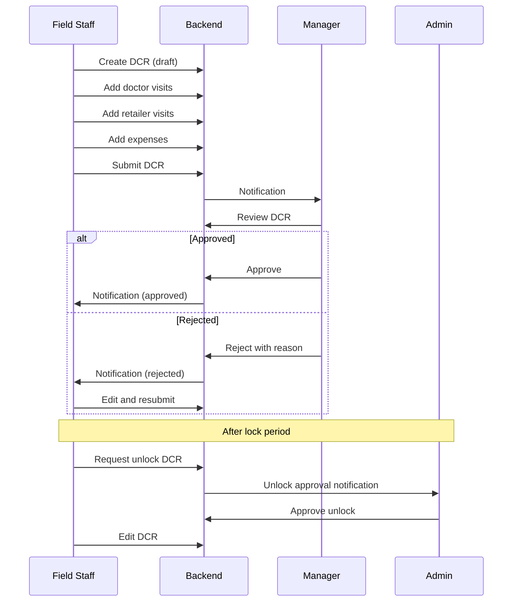

# Workflows & Notifications

## Approval Workflow Pattern

Every transactional module follows the same pattern:

```
┌─────────┐    Submit     ┌─────────┐   Approve    ┌──────────┐
│  Draft  │──────────────▶│ Pending │─────────────▶│ Approved │
└─────────┘               └────┬────┘              └──────────┘
                               │ Reject
                               ▼
                          ┌──────────┐
                          │ Rejected │
                          └──────────┘
```

After approval, records are **locked**. Users must raise an **Unlock Request** to edit.

## All Approval Queues

| # | Approval | Route | API Status Endpoint |
|---|----------|-------|---------------------|
| 1 | Doctor Creation | `/app/doctor-approval` | `doctor/doctor-approval` |
| 2 | Retailer Creation | `/app/retailer-approval` | `retailer/pending` |
| 3 | Tour Programme | `/app/monthlyRTP/approval` | `monthly-rtp/pending` |
| 4 | Gift/Sample Requisition | `/app/requisition/approval` | `requisition/pending` |
| 5 | Leave | `/app/leave/approval` | `leave/status` |
| 6 | Unlock DCR | `/app/unlockDCRRequest` | `unlockDCR/pending` |
| 7 | Expense Statement | `/app/expenseStatement/approval` | `miscellaneous-expense/pending/` |
| 8 | DCR (Admin) | `/app/dcrRecord/approval/admin` | `dcr/dcr-approval-admin/` |
| 9 | Doctor Delete | `/app/pendingDoctorDeleteRequest` | `doctor/pending/deactivateRequest` |
| 10 | Weekly Plan | `/app/pendingWeeklyPlan` | `weeklyPlan/pending` |
| 11 | Infiltration | `/app/infiltration/approval` | `infiltration/pending` |
| 12 | Input & Sales Plan | `/app/input-salesPlan/pending` | `input-salesPlan/pending` |
| 13 | Retailer Delete | `/app/retailerDeleteRequest/approval` | `retailer/de-activate/pending` |
| 14 | Focused Activity Plan | `/app/focusedActivityPlan/approval` | `focusedActivityPlan/pending` |
| 15 | Manager Day Allocation | `/app/managerDayAllocation/approval` | `managerDayAllocation/pending` |

## Notification System

### Notification Bell

**Route:** `/app/notification`  
**APIs:**
- `notification/read`
- `notification/readAll`
- `notification/viewmore/`

### What Triggers Notifications

| Event | Recipient |
|-------|-----------|
| RTP submitted | Reporting manager |
| DCR submitted | Manager / admin |
| Leave applied | Reporting manager |
| Doctor creation requested | Admin / manager |
| Expense statement submitted | Manager |
| Stock statement unlock requested | Admin |
| Weekly plan submitted | Manager |
| Gift/sample requisition | Admin |

### Dashboard Pending Counts

- `dashboard/pending-submittion` — pending items for logged-in user
- `manager-dashboard/pending-count` — manager's team pending count
- `dashboard/unreadMessageCount/` — unread messages

## DCR Workflow (Detailed)



### DCR APIs

| Action | API |
|--------|-----|
| List DCRs | `dcr/list/` |
| Doctor visits | `dcr/doctor` |
| Retailer visits | `dcr/retailer-stockist` |
| Submit | POST `dcr/list/` |
| Approve | `dcr/dcr-approval` |
| Admin approve | `dcr/dcr-approval-admin/` |
| Review | `dcr/review` |
| Summary | `dcr/summarize-data/` |
| Calendar view | `dcr/calendar-dcr/` |
| Force edit | `dcr/forcefullyEdit` |
| Delete (admin) | `dcr/doctor/delete`, `dcr/retailer/delete` |

## RTP Workflow

1. MR creates monthly RTP (calendar view)
2. Assigns routes per day
3. Submits for approval
4. Manager approves/rejects
5. Approved RTP guides daily field work

APIs: `monthly-rtp/emp/`, `monthly-rtp/weekCalendar/`, `monthly-rtp/status`

## Unlock Request Pattern

Used for: DCR, Stock Statement, Weekly Plan

1. User submits unlock request with reason
2. Manager/Admin receives notification
3. Approver grants or denies unlock
4. If granted, record becomes editable for limited time

## Clone Implementation

### Database

```sql
CREATE TABLE notifications (
  notification_id SERIAL PRIMARY KEY,
  emp_id INT,
  title VARCHAR(200),
  message TEXT,
  menu_url VARCHAR(200),
  reference_id INT,
  is_read BOOLEAN DEFAULT false,
  created_at TIMESTAMP
);

CREATE TABLE approval_history (
  id SERIAL PRIMARY KEY,
  entity_type VARCHAR(50),
  entity_id INT,
  action VARCHAR(20), -- submit/approve/reject/unlock
  action_by INT,
  comments TEXT,
  action_at TIMESTAMP
);
```

### Backend

- Emit notification on every status change
- WebSocket or polling for real-time notification count
- Push notification to mobile via Firebase
