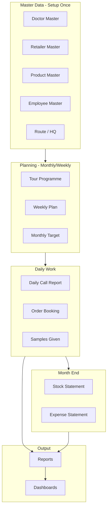

# Simple Guide — What Data Exists & How Everything Works

> **Read this first** if you want plain English before diving into 146 feature docs.

---

## What Is This App? (One Paragraph)

Synchem Salestrip is a **field force app for pharma sales**. Medical Representatives (MRs) visit doctors and chemists every day. They log visits, show product presentations, give free samples, take orders, and claim travel expenses. Managers approve their work. Head Office sees reports. **This guide explains every part with real examples.**

---

## The 5 Types of Data in the System

| Type | What it means | Examples |
|------|---------------|----------|
| **1. Master Data** | Fixed lists used everywhere | Doctors, chemists, products, cities, routes |
| **2. Plans** | What you INTEND to do | Monthly tour plan, weekly doctor plan, targets |
| **3. Transactions** | What you ACTUALLY did | Daily call report (DCR), orders (POB), expenses |
| **4. Approvals** | Manager says yes/no | Approve leave, DCR, tour plan, sample request |
| **5. Reports** | Read-only analysis | Sales, calls, missed doctors, target vs achievement |

---

## Real Characters (Example Team)

| Person | Role | What they do |
|--------|------|--------------|
| **Admin** | Head Office | Sets up doctors, products, roles, company settings |
| **Priya** | Area Manager | Approves Amit's work, sees team reports |
| **Amit** | Medical Rep (MR) | Visits doctors/chemists daily, submits DCR |

**Company:** Synchem Pharmaceuticals | **Code:** SYN | **City:** Indore

---

## Master Data — What Is Stored

### Geography
| Screen | Data | Example |
|--------|------|---------|
| City Master | City name + state | Ujjain, Madhya Pradesh |
| HQ Master | Sales territory | Indore-1, Dewas, Ujjain |
| Route Master | Beat within HQ | IND-R-05 (Vijay Nagar beat) |

### People & Customers
| Screen | Data | Example |
|--------|------|---------|
| Employee Master | MR/Manager login accounts | Amit, username: amit, HQ: Indore-1 |
| Doctor Master | Doctors to visit | Dr. Ramesh Verma, Cardiologist, 2 visits/month |
| Retailer Master | Chemists | Sharma Medical Store, Vijay Nagar |
| Stockist Master | Distributors | Indore Pharma Distributors |

### Products
| Screen | Data | Example |
|--------|------|---------|
| Product Master | Medicines/SKUs | SYNPAR-500, Paracetamol, MRP ₹30 |
| Brand Master | Brand names | Synpar, Syncold |
| Division | Business line | Ethical |

### Settings Lists
Designation, Dosage, Expense Head, Holiday, Category, Packing Type, Qualification, Specialist, Visit Purpose

---

## Daily Life of an MR (Main Workflow)

```
Morning                          Field                          Evening
───────                          ─────                          ───────
Login                     Visit Dr. Verma                  Submit DCR
Check dashboard    →      Detail SYNPAR product     →    Log expenses
See today's plan          Give 2 samples                  Check POB total
                          Visit Chemist Sharma
                          Take ₹5000 order (POB)
```

### Step-by-step (Amit's Monday)

1. **Login** → Field Staff Dashboard shows "8 doctor calls today"
2. **Check RTP** → Monday = Route IND-R-05
3. **Visit Dr. Verma** → Detail SYNPAR for 10 minutes, give 2 samples
4. **Visit Chemist Sharma** → Book order: 50 strips SYNPAR (POB ₹5000)
5. **Create DCR** → Log both visits, products, samples, ₹350 travel
6. **Submit DCR** → Goes to Manager Priya for approval
7. **Priya approves** → DCR locked, counts in reports

---

## Monthly Cycle (Bigger Workflow)

| Week | What happens | Screen |
|------|--------------|--------|
| **Last week of month** | MR plans next month's routes | Tour Programme (RTP) |
| **Manager approves RTP** | | Tour Programme Approval |
| **Each week** | MR plans which doctors per day | Weekly Plan |
| **Each day** | MR submits DCR | Daily Call Report |
| **Month end** | MR submits stock survey from chemists | Stock Statement |
| **Month end** | MR submits expense claim | Expense Statement |
| **Month end** | Manager reviews all reports | 60+ report screens |

---

## Transaction Screens — What Each Does

| Screen | Short | Real Example |
|--------|-------|--------------|
| **Tour Programme** | Monthly route calendar | June: Mon=Route A, Tue=Route B... |
| **Daily Call Report** | Today's field log | 3 doctors, 2 chemists, ₹350 expense |
| **POB** | Order booking | Chemist orders 50 strips SYNPAR |
| **Weekly Plan** | Which doctors this week | Mon=Dr.Verma, Tue=Dr.Patel |
| **Leave Application** | Apply for leave | 2 days CL for wedding |
| **Stock Statement** | Chemist stock survey | Opening 100, sold 80, closing 70 |
| **Expense Statement** | Monthly expense claim | ₹13,500 total for June |
| **Gift/Sample Requisition** | Request free samples | 100 SYNPAR samples for June |
| **Infiltration** | Competitor tracking | Rival brand found at chemist |

---

## Approval Screens — Manager Says Yes/No

| Approval | What is being approved | Example |
|----------|------------------------|---------|
| Doctor Approval | New doctor added by MR | New cardiologist in area |
| Tour Programme Approval | Monthly plan | Amit's June route plan |
| DCR Approval | Daily report | Monday's DCR with 5 visits |
| Leave Approval | Leave request | 2 days casual leave |
| Expense Approval | Monthly expense | ₹13,500 claim |
| Weekly Plan Approval | Weekly doctor plan | Week 2 doctor list |
| Gift/Sample Approval | Sample request | 100 samples for Amit |

**Workflow pattern everywhere:**
```
Employee submits → Status = Pending → Manager opens Approval screen
→ Approve or Reject → Employee gets notification
```

---

## Report Screens — View Only (No Changes)

| Report | What you see | Example output |
|--------|--------------|----------------|
| DCR Summary | Calls per MR | Amit: 120 calls in June |
| Missed Calls | Doctors not visited | Dr. Patel missed — should visit 2x |
| Target Achievement | Plan vs actual | Amit: 85% of target |
| Sales Summary | Total sales | June: ₹1.2 Cr secondary sales |
| Employee POB | Orders per MR | Amit ₹2.1L POB |
| Attendance Report | Field days | 22 field days, 2 leave |

---

## Complete Data Flow Diagram



---

## Glossary (Short Forms)

| Short | Full Form | Meaning |
|-------|-----------|---------|
| **SFA** | Sales Force Automation | This type of field force software |
| **MR** | Medical Representative | Field sales person who visits doctors |
| **DCR** | Daily Call Report | Daily log of field visits |
| **RTP** | Route Tour Programme | Monthly plan of which routes to visit |
| **POB** | Personal Order Booking | Orders taken from doctors/chemists |
| **HQ** | HeadQuarter | Sales territory (e.g., Indore-1) |
| **HCP** | Healthcare Professional | Doctor |
| **FS** | Field Staff | MR role code in system |
| **MAN** | Manager | Manager role code |
| **AD** | Admin | Admin role code |
| **HO** | Head Office | Central admin team |
| **CL/SL/PL** | Casual/Sick/Privileged Leave | Leave types |
| **SKU** | Stock Keeping Unit | One product pack size |
| **MRP** | Maximum Retail Price | Product price |
| **PTS** | Price to Stockist | Wholesale price |

---

## Where to Find Each Feature Doc

Every screen has its own `.md` file under `docs/modules/` with:
- **In Short** — one-line explanation
- **Real Example** — Synchem scenario
- **What Data Is Here** — fields stored
- **Step-by-Step Workflow** — clone instructions

Use [00-index.md](./00-index.md) to navigate all 146 screens.
