# FINAL MASTER FLOWCHART — 100% Clone Blueprint

> Complete visual map of Synchem Salestrip SFA. Use with [12-MASTER-CLONE-BIBLE.md](./12-MASTER-CLONE-BIBLE.md).

---

## 1. System at a Glance

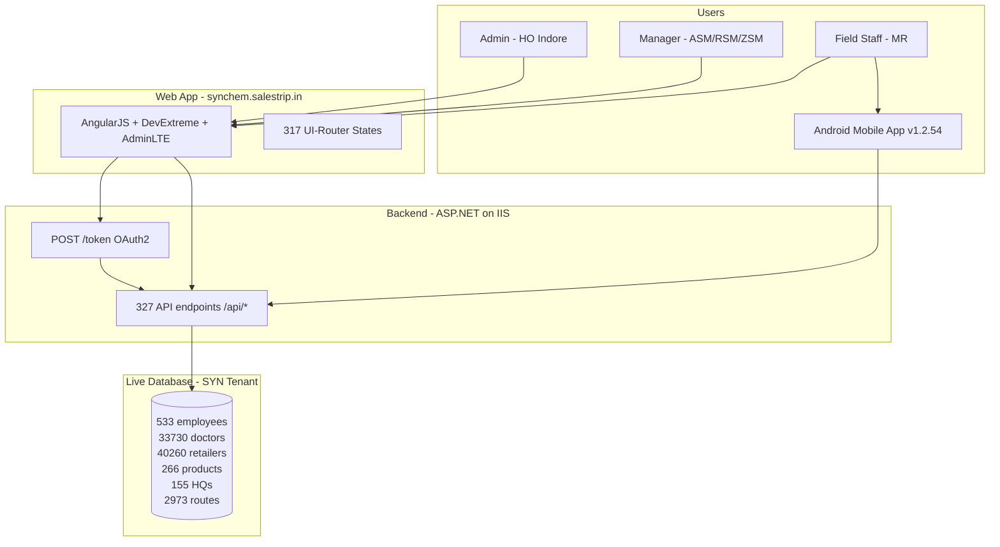

---

## 2. Login & Session Flow

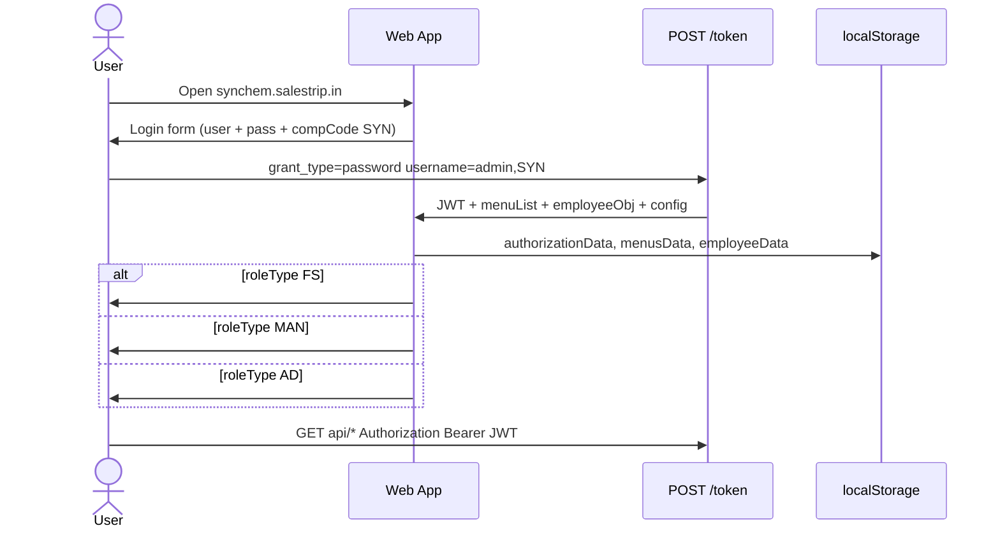

---

## 3. Organization Hierarchy (Live Data)

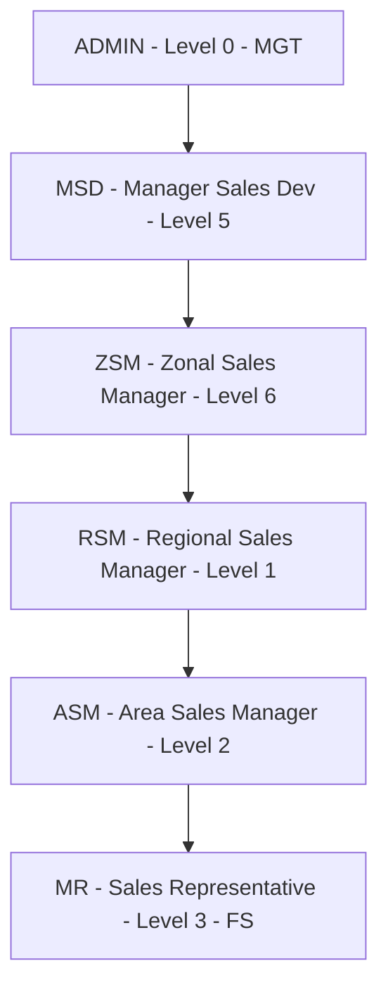

**Real example:** MR `MRJPR2` (Vacant Jabalpur3) → reports to Manager `Santosh Kumar` (empId 379) → HQ `Jabalpur 3`

---

## 4. Geography & Territory Model

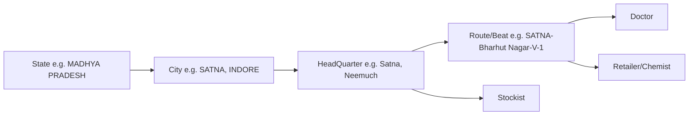

**Real example from live data:**
- Doctor: `(major) RAMCHANDRA TRIPATHI` → Route `SATNA-Bharhut Nagar(V)-1(S5)` → HQ `Satna` → City `SATNA`
- Retailer: `ZULFI MEDICAL2` → Route `FOCUS NEEMUCH-SUP-CORE-(S3)` → HQ `Neemuch`

---

## 5. Master Data Setup Order (Clone Build Sequence)

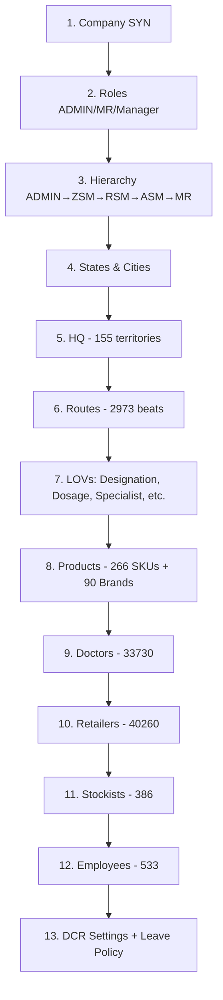

---

## 6. Monthly Field Force Cycle (THE MAIN LOOP)

```mermaid
flowchart TD
    START([Month Start]) --> RTP[MR creates Tour Programme RTP]
    RTP --> RTPA{Manager approves RTP?}
    RTPA -->|No| RTP
    RTPA -->|Yes| WEEK[MR creates Weekly Plan]
    WEEK --> WPA{Manager approves Weekly Plan?}
    WPA -->|Yes| DAILY

    subgraph DAILY [Every Working Day]
        DAILY[MR goes to field] --> VISIT[Visit doctors & chemists]
        VISIT --> DCR[Submit Daily Call Report DCR]
        VISIT --> POB[Personal Order Booking optional]
        DCR --> DCRA{Manager approves DCR?}
        DCRA -->|Yes| NEXT[Next day]
        NEXT --> DAILY
    end

    DAILY --> MONTHEND([Month End])
    MONTHEND --> STOCK[Stock Statement from chemists]
    MONTHEND --> EXP[Expense Statement]
    STOCK --> REPORTS[60 Reports + Dashboards]
    EXP --> EXPA{Manager approves expense?}
    EXPA --> REPORTS
    REPORTS --> TARGET[Target vs Achievement]
    TARGET --> START
```

---

## 7. Daily Call Report (DCR) — Internal Flow

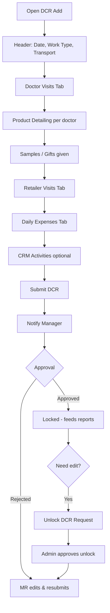

**DCR Work Types (live):** GENERAL MEET, GIFT DISTRIBUTION, Order Submission, RETAILER SURVEY, Sample Distribution, Stock Statement Collection, Work With ASM/RSM/ZSM

**Transport modes (live):** By Bike, By Bus, By Car, By Train

---

## 8. Gift / Sample Flow

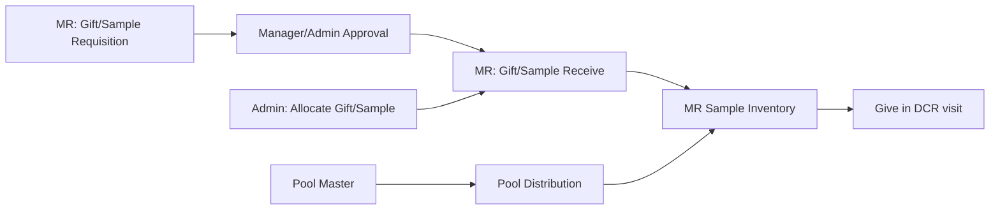

---

## 9. Approval Hub (15 Queues — Live Pending Counts)

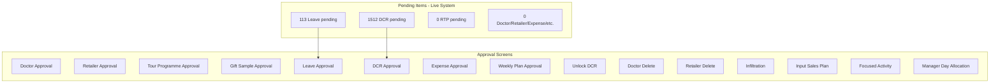

---

## 10. Product → Sale → Report Data Flow

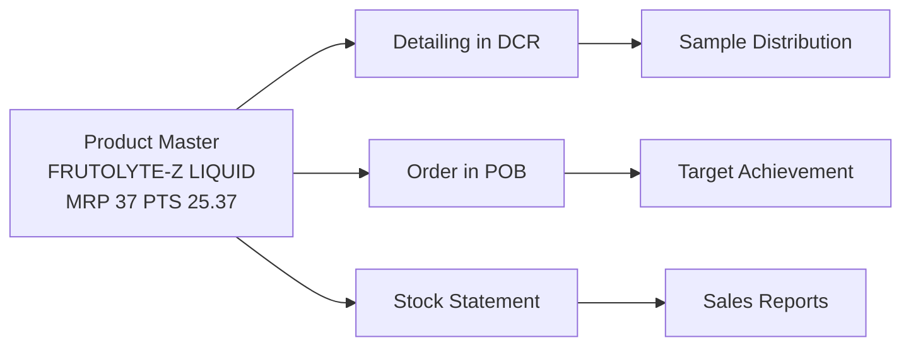

---

## 11. All 7 Top Modules Map

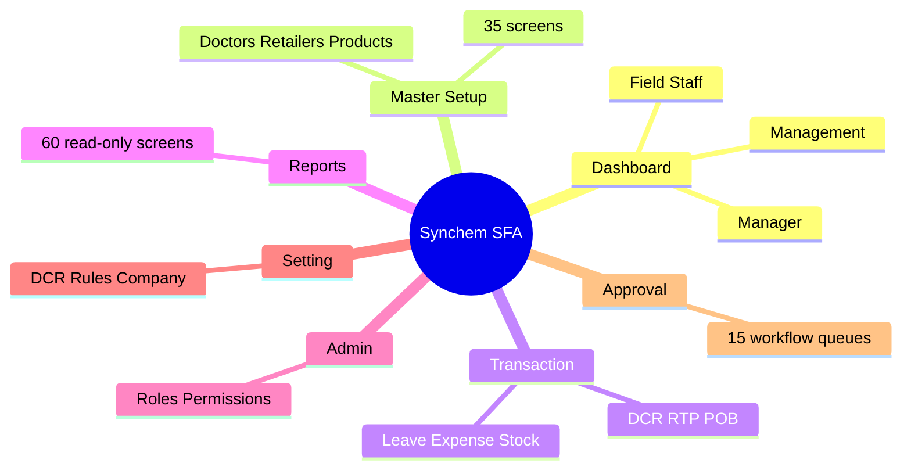

---

## 12. Clone Implementation Flow

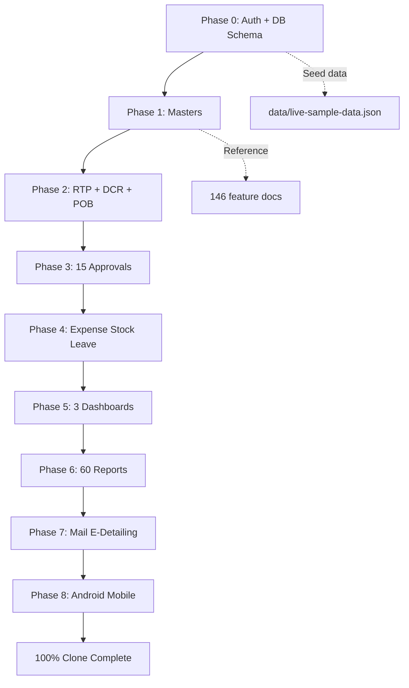

---

*This flowchart references live data fetched read-only from synchem.salestrip.in on 2026-06-12.*
