# Enterprise Architecture — Production-Ready Clone Blueprint

Target architecture for rebuilding **Synchem Salestrip SFA** as a scalable, **multi-tenant Pharma SFA SaaS** platform.

> **⭐ Master build plan:** [17-FINAL-BUILD-PLAN.md](./17-FINAL-BUILD-PLAN.md) — locked stack, 6-month MVP, 500 users  
> **Related:** [01-platform-overview](./01-platform-overview.md) · [02-tech-stack-architecture](./02-tech-stack-architecture.md) · [08-clone-roadmap](./08-clone-roadmap.md) · [15-mobile-stack](./15-mobile-stack.md)

---

## Executive Summary

| Decision | Recommendation |
|----------|----------------|
| Architecture style | **Modular monolith** first, extract services later |
| Backend | **NestJS (Node.js + TypeScript)** — final choice |
| Database | **PostgreSQL 16** (primary + read replica at scale) |
| Web | **React 18 + TypeScript** |
| Mobile | **React Native + Expo + WatermelonDB** (offline-first) |
| Multi-tenancy | Shared DB, shared schema, **`compCode` on every row** |
| Async | **pg-boss** (MVP) → BullMQ/SQS at scale |

### Final Stack — TypeScript Everywhere

```
Web      → React 18 + TypeScript + Vite
Mobile   → React Native + Expo + WatermelonDB
Backend  → NestJS + TypeScript + Prisma
Database → PostgreSQL (Supabase / Neon managed)
```

One language across web, mobile, and API — easier hiring, lower cost, faster delivery for a greenfield clone built from docs (no original source code to port).

### Mobile Stack (Final) — React Native

| Component | Choice | Purpose |
|-----------|--------|---------|
| Framework | **React Native + Expo SDK 55+** | Cross-platform (Android + iOS), New Architecture |
| Offline DB | **WatermelonDB** | Local SQLite, reactive UI, DCR offline-first |
| Sync | Custom delta API (NestJS) → PowerSync optional at scale | `{ lastSyncAt, changes[] }` pull/push |
| Location | **expo-location** + background tasks | GPS check-in, live tracking, geo-fencing |
| Auth | **expo-local-authentication** | MPIN, fingerprint, secure token storage |
| Push | **Firebase FCM** | Approval alerts, pending work bell |
| Maps | **Mapbox** | Route display, MR tracking (cheaper at scale) |
| State | TanStack Query + Zustand | Server state + local UI state |
| Shared code | `packages/shared-types`, `packages/api-client` | Same DTOs as web and NestJS |

**Why React Native (not Flutter):** Matches NestJS + React web stack (TypeScript everywhere), WatermelonDB is production-proven for field offline sync, and Indian pharma case studies (e.g. Bengal Remedis) use React Native + Node + PostgreSQL.

**Why modular monolith?** The platform has ~146 screens, 327+ APIs, and tightly coupled flows (RTP → DCR → Approval → Expense). A well-structured monolith ships faster and stays easier to operate than premature microservices.

---

## 1. High-Level System Architecture

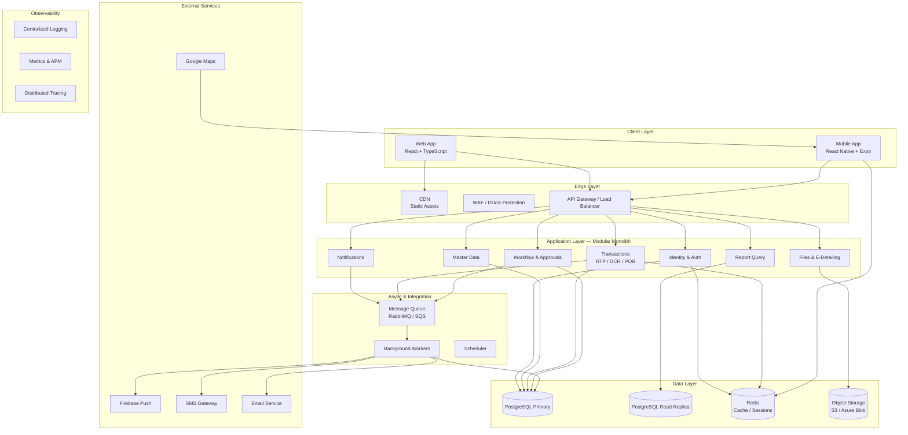

---

## 2. Request Flow (Web / Mobile → API)

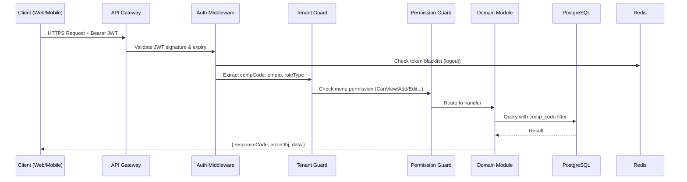

### API Response Contract (keep parity with original)

```json
{
  "responseCode": 200,
  "errorObj": null,
  "data": { }
}
```

| responseCode | Meaning |
|--------------|---------|
| 200 | Success |
| 401 | Unauthorized — redirect to login |
| 417 | Business validation error |

---

## 3. Authentication Flow

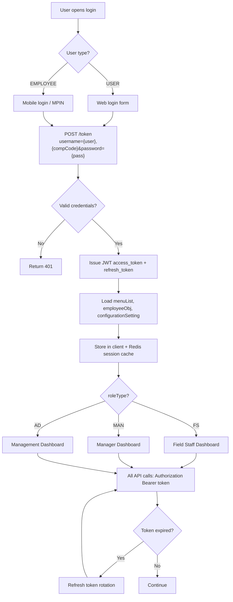

See [03-authentication-and-security.md](./03-authentication-and-security.md) for full login, OTP, and impersonation details.

---

## 4. Multi-Tenancy Architecture

Every tenant is identified by **`compCode`** (e.g. `SYN` for Synchem).

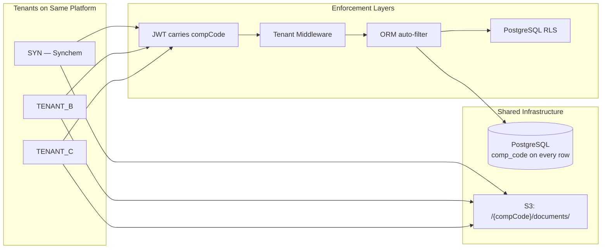

### Rules

1. JWT always carries `compCode`, `empId`, `roleType`
2. Middleware injects tenant context into every request
3. Repository layer **never** queries without `WHERE comp_code = :tenant`
4. PostgreSQL Row-Level Security (RLS) as safety net
5. File storage uses tenant prefix: `s3://bucket/{compCode}/...`

---

## 5. Backend Module Map (Bounded Contexts)

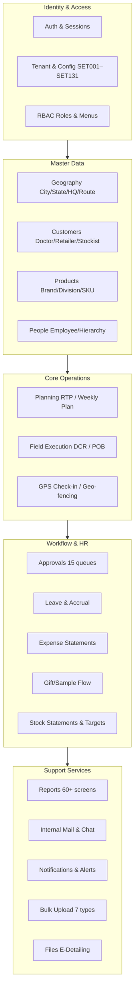

| Module | Key Entities | API Prefix Examples |
|--------|--------------|---------------------|
| Identity & Auth | User, Session, Company | `/token`, `/api/users/*` |
| Master Data | Doctor, Retailer, Product, HQ, Route | `/api/doctor/*`, `/api/product/*` |
| Transactions | RTP, DCR, POB, WeeklyPlan | `/api/dcr/*`, `/api/tourProgramme/*` |
| Workflow | ApprovalRequest | `/api/approval/*` |
| Reporting | Report views, exports | `/api/reports/*` |
| Communication | Mail, Message, Notification | `/api/mail/*`, `/api/notification/*` |

---

## 6. Approval Workflow Engine

Do **not** hardcode 15 separate approval flows. Use a generic, config-driven engine.

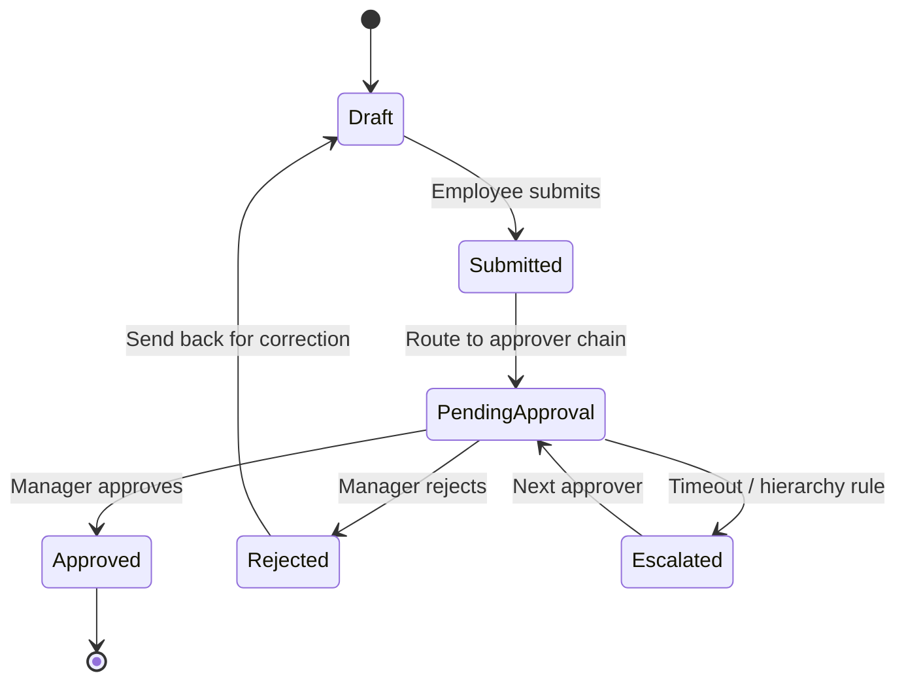

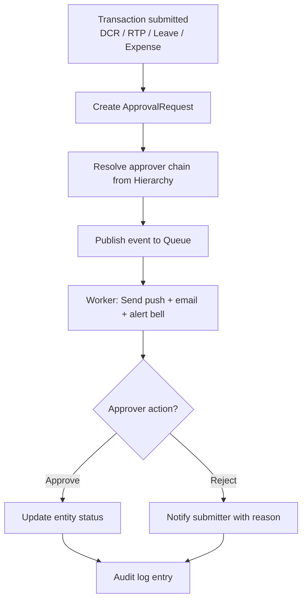

Supported approval types (from spec): DCR, RTP, Weekly Plan, Doctor/Retailer create-delete, Leave, Expense, Gift/Sample, Stock unlock, Infiltration, and more — see [modules/approval/](./modules/approval/).

---

## 7. Data Architecture (OLTP vs Analytics)

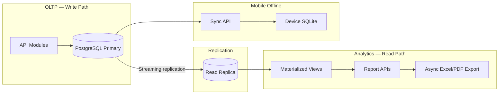

### Database Design Principles

| Principle | Implementation |
|-----------|----------------|
| Normalization | OLTP tables for DCR, RTP, POB, approvals |
| Tenant isolation | `comp_code` column + index on every table |
| Performance indexes | `(comp_code, emp_id, date)`, `(comp_code, route_id)` |
| Heavy reports | Read replica — never crush primary DB |
| Dashboards | Materialized views (refresh 15–60 min or on event) |
| Large tables | Monthly partitioning (`dcr_visits_2026_06`) at scale |
| Bulk uploads | Validate in worker, not HTTP thread |
| Audit | `entry_by`, `update_by`, `delete_by` + immutable audit log |

See [04-data-model-entities.md](./04-data-model-entities.md) for entity relationships.

---

## 8. Mobile Offline Sync Flow

Field staff (FS) must submit DCR when network is unreliable.

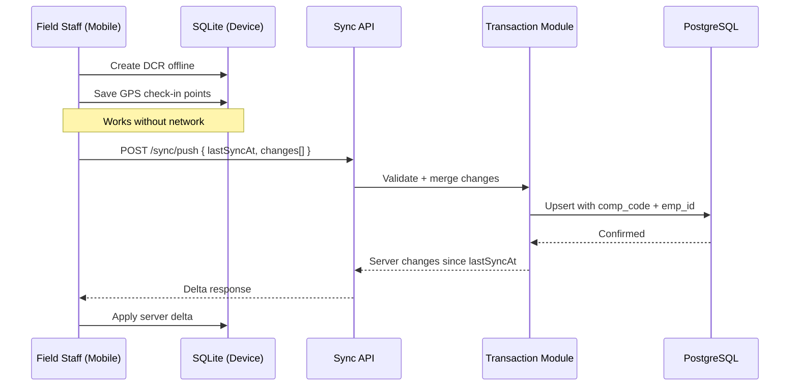

| Concern | Strategy |
|---------|----------|
| Local storage | **WatermelonDB** (SQLite on native thread) |
| Sync model | Delta sync — `{ lastSyncAt, changes[] }` via NestJS Sync API |
| Sync fallback | **PowerSync** (optional) if custom sync grows complex |
| Master data conflicts | Server wins |
| DCR draft conflicts | Last-write-wins or manual merge |
| GPS | Batch location pings; geofencing from employee settings |
| Push | Firebase Cloud Messaging (`PushToken` on employee) |
| Local auth | MPIN / biometric via Expo; refresh token in secure storage |

---

## 9. Async Processing Pipeline

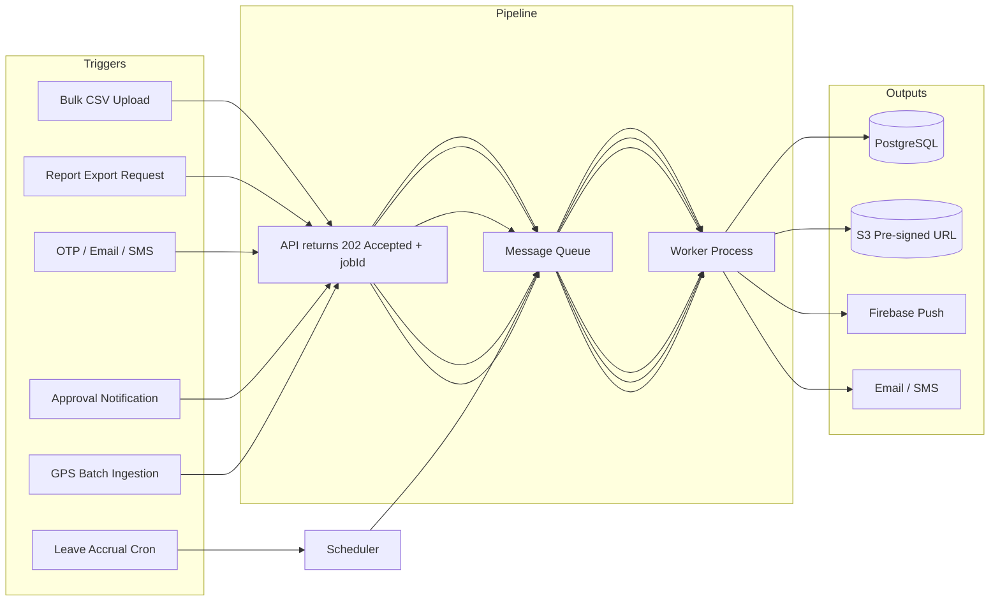

Long-running tasks must **never** block HTTP request threads.

---

## 10. Field Force Daily Flow (Business Context)

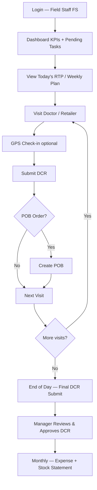

---

## 11. RBAC & Authorization Flow

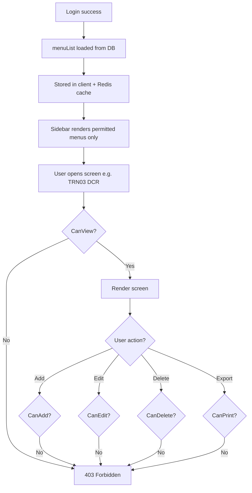

Permissions: `CanView`, `CanAdd`, `CanEdit`, `CanDelete`, `CanPreview`, `CanPrint` — see [06-role-permissions.md](./06-role-permissions.md).

---

## 12. Infrastructure & Deployment

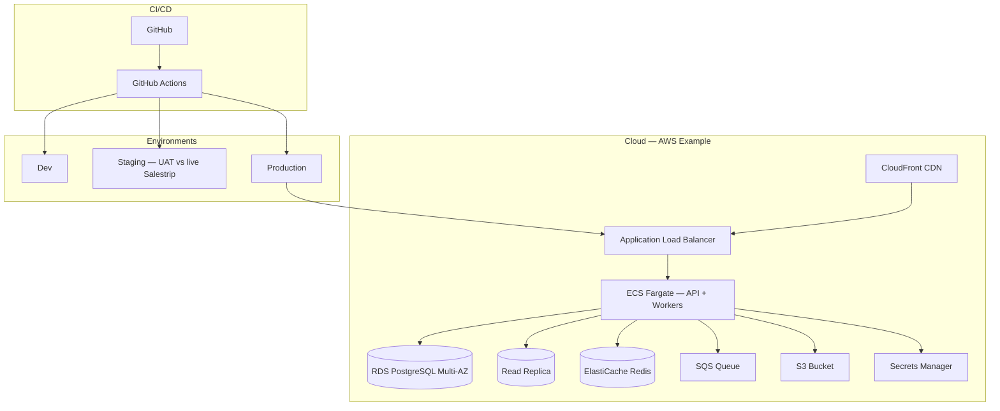

### Environment Matrix

| Component | Dev | Staging | Production |
|-----------|-----|---------|------------|
| API instances | 1 | 2 | 2+ (autoscale) |
| PostgreSQL | Single | Multi-AZ | Multi-AZ + read replica |
| Redis | Single | Cluster | Cluster mode |
| Backups | Daily | Daily + PITR | Daily + PITR + cross-region |
| Monitoring | Basic | Full | Full + alerting |

### High Availability Checklist

- [ ] Min 2 API instances behind load balancer
- [ ] PostgreSQL Multi-AZ with automated backups (PITR)
- [ ] Redis cluster mode
- [ ] Health endpoints: `/health`, `/ready`
- [ ] WAF + HTTPS only (ACM certificates)
- [ ] Secrets in vault — never in source code

---

## 13. Observability

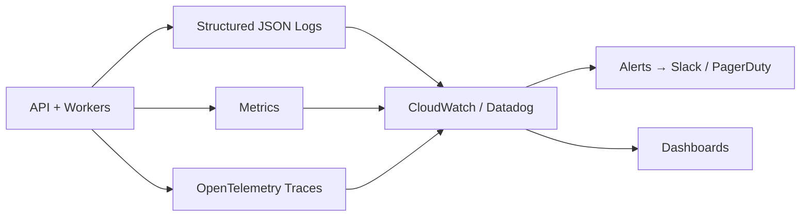

| Pillar | What to track |
|--------|---------------|
| Logs | Request ID, compCode, empId, action, latency |
| Metrics | Error rate, p95 latency, queue depth, DB connections |
| Tracing | Cross-service request paths |
| Audit | Immutable log: who changed doctor/DCR/approval |
| Alerts | Error spike, DB CPU > 80%, queue backlog |

---

## 14. Monorepo Structure

```
synchem-sfa/
├── apps/
│   ├── web/                    # React web app
│   ├── mobile/                 # React Native app
│   ├── api/                    # NestJS modular monolith
│   └── worker/                 # Background job processor
├── packages/
│   ├── shared-types/           # DTOs, enums (RoleType, MenuCode)
│   ├── api-client/             # Generated from OpenAPI
│   └── ui-components/          # Shared design system
├── infra/
│   ├── terraform/              # Infrastructure as Code
│   └── docker/
├── docs/                       # This specification repo
└── openapi/
    └── sfa-api.yaml            # Contract-first API definition
```

---

## 15. Recommended Tech Stack

| Layer | Technology | Notes |
|-------|------------|-------|
| Web frontend | React 18 + TypeScript + Vite | 146 screens; TanStack Query for server state |
| UI grids | AG Grid or MUI DataGrid | Replaces DevExtreme; export + virtualization |
| Mobile | **React Native + Expo + WatermelonDB** | Offline DCR, GPS, push |
| Backend | **NestJS** | Modular monolith with bounded contexts |
| Database | PostgreSQL 16 | Primary; read replica at scale |
| ORM | **Prisma** | Migrations + type safety |
| Cache | Redis | Sessions, menu cache, rate limiting |
| Queue | SQS or RabbitMQ | Async jobs |
| File storage | S3 / Azure Blob | E-detailing, bulk uploads, logos |
| Auth | OAuth2 + JWT + refresh rotation | Keep `/token` endpoint pattern |
| Maps | Google Maps Platform | Routes, geo-fencing, live tracking |
| Push | Firebase Cloud Messaging | Mobile notifications |
| Email/SMS | SES / SendGrid + SMS gateway | OTP, alerts |
| IaC | Terraform | Reproducible environments |
| CI/CD | GitHub Actions | Build → test → deploy |

---

## 16. Scalability Roadmap

```mermaid
flowchart LR
    subgraph phase1 [Phase 1 — MVP]
        P1A[1 tenant]
        P1B[~500 users]
        P1C[Modular monolith]
        P1D[Single region]
    end

    subgraph phase2 [Phase 2 — Growth]
        P2A[5–10 tenants]
        P2B[~5K users]
        P2C[Read replica]
        P2D[Queue workers]
        P2E[CDN + autoscale]
    end

    subgraph phase3 [Phase 3 — Enterprise]
        P3A[50+ tenants]
        P3B[50K+ users]
        P3C[Extract report service]
        P3D[Extract sync service]
        P3E[Multi-region DR]
    end

    phase1 --> phase2 --> phase3
```

### When to Extract Microservices

| Service | Extract when… |
|---------|---------------|
| Report service | Report queries slow OLTP or block writes |
| Notification service | Push/email volume exceeds worker capacity |
| Sync service | Mobile traffic dominates API load |
| Search service | Mail/chat search needs OpenSearch/Elasticsearch |

---

## 17. Security Checklist

| Area | Requirement |
|------|-------------|
| Transport | HTTPS only, TLS 1.2+ |
| Auth | Short-lived JWT + refresh token rotation |
| Tenant isolation | Middleware + ORM filter + PostgreSQL RLS |
| RBAC | Permission guard on every endpoint |
| Rate limiting | Per user/IP on `/token` and sensitive APIs |
| Password policy | 8–15 chars, number + special character |
| Impersonation | Audit every admin "login as user" action |
| Files | Pre-signed URLs, virus scan on upload |
| Secrets | AWS Secrets Manager / Azure Key Vault |
| Compliance | Immutable audit trail for data changes |

---

## 18. Implementation Priority

Aligned with [08-clone-roadmap.md](./08-clone-roadmap.md):

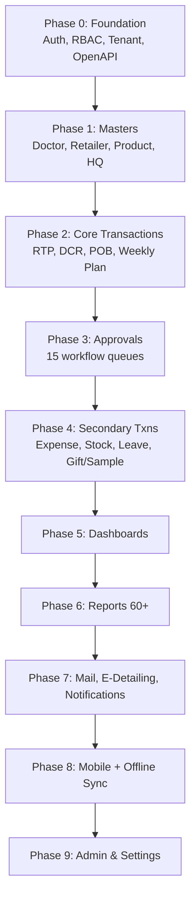

**Enterprise foundations to build in Phase 0 (non-negotiable):**

1. Multi-tenant middleware (`compCode`)
2. JWT auth + refresh token rotation
3. RBAC permission guards
4. OpenAPI contract (shared by web + mobile)
5. Message queue + worker skeleton
6. Structured logging + health checks
7. Audit log table

---

## 19. Key Risks & Mitigations

| Risk | Mitigation |
|------|------------|
| Hidden business rules in legacy backend | UAT against live system; config-driven rules (SET001–SET131) |
| 60 reports crushing OLTP DB | Read replica + materialized views + async export |
| Mobile offline sync conflicts | Dedicated sync API — not generic REST CRUD |
| Multi-tenant data leak | Tenant middleware + RLS + integration tests per tenant |
| 15 approval flows duplicated | Generic workflow engine with config per entity type |
| Large team coordination | Monorepo + OpenAPI contract + modular backend folders |

---

## 20. Original vs Target Architecture

| Aspect | Original (Salestrip) | Target (Enterprise Clone) |
|--------|----------------------|---------------------------|
| Frontend | AngularJS 1.x + DevExtreme | React + TypeScript + modern grid |
| Backend | ASP.NET Web API on IIS | **NestJS** (Node.js + TypeScript) |
| Database | SQL Server | PostgreSQL (+ read replica at scale) |
| Deployment | Single IIS server | Fly.io Mumbai + Vercel (MVP) → AWS at scale |
| Files | Server filesystem | Cloudflare R2 / S3 |
| Async | Synchronous | pg-boss → queue + workers |
| Mobile | Android native | React Native + Expo + WatermelonDB |
| Observability | Limited | Full logs, metrics, tracing, audit |
| Multi-tenant | compCode (same pattern) | compCode + RLS + tenant middleware |

---

*Document version: 1.0 — June 2026*
