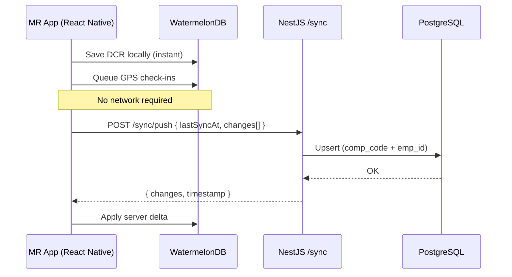

# Mobile Stack — React Native (Final Decision)

Mobile app for **Synchem Salestrip SFA clone** — field staff (MR), managers on-the-go, offline DCR, GPS tracking.

> **Related:** [14-enterprise-architecture.md](./14-enterprise-architecture.md) · [08-clone-roadmap.md](./08-clone-roadmap.md) (Phase 8) · [03-authentication-and-security.md](./03-authentication-and-security.md)

---

## Final Stack

```
React Native + Expo SDK 55+
        │
        ├── WatermelonDB     (offline SQLite)
        ├── TanStack Query   (API cache)
        ├── Zustand          (UI state)
        ├── expo-location    (GPS / geo-fencing)
        ├── expo-local-auth  (MPIN / biometric)
        └── Firebase FCM     (push notifications)
              │
              ▼
        NestJS API (same types as web)
              │
              ▼
        PostgreSQL
```

| Layer | Technology |
|-------|------------|
| Framework | **React Native + Expo** |
| Language | **TypeScript** (shared with web + NestJS) |
| Offline DB | **WatermelonDB** |
| Sync | NestJS delta sync API → PowerSync optional later |
| Maps | **Mapbox** |
| Push | **Firebase Cloud Messaging** |
| Auth | OAuth2 `/token` + MPIN + biometric |

---

## Why React Native

| Reason | Detail |
|--------|--------|
| Same ecosystem | Web (React) + API (NestJS) + mobile = **TypeScript everywhere** |
| Offline DCR | **WatermelonDB** — proven for field apps, native-thread SQLite |
| Hiring (India) | More React Native devs than Flutter; web devs can contribute |
| Real precedent | Indian pharma stacks use RN + Node + PostgreSQL (e.g. Bengal Remedis) |
| Original parity | Clone Android v1.2.54 features; iOS free from same codebase |

Flutter was evaluated and rejected for this project — separate language (Dart), no shared types with NestJS/React, custom offline sync effort higher.

---

## Core Mobile Features (from spec)

| Feature | Priority | Implementation |
|---------|----------|----------------|
| Offline DCR submit | P0 | WatermelonDB → sync when online |
| Tour plan (RTP) view | P0 | Cached masters + API |
| GPS check-in / check-out | P0 | `expo-location`, batch upload |
| Geo-fencing | P0 | Server rules + client validation |
| MPIN / fingerprint login | P0 | `expo-local-authentication` |
| Push notifications | P0 | Firebase FCM |
| POB, Leave, Expense | P1 | Online + offline draft where needed |
| E-detailing (PDF/PPT) | P1 | Download + cache on device |
| Manager approvals | P1 | Online (manager flows) |
| Internal mail / alerts | P2 | Online |

---

## Offline Sync Architecture



### Sync rules

| Data type | Conflict strategy |
|-----------|-------------------|
| Masters (doctor, product) | Server wins |
| DCR draft | Last-write-wins or manual merge |
| GPS pings | Append-only (no conflict) |
| Approvals | Server authoritative |

### Phase 2 option

If custom sync becomes complex at scale, add **PowerSync** (PostgreSQL ↔ SQLite) — supports React Native, free tier available, self-hostable.

---

## Monorepo placement

```
synchem-sfa/
├── apps/
│   ├── mobile/              # React Native + Expo
│   └── api/                 # NestJS
├── packages/
│   ├── shared-types/        # DTOs, enums — used by mobile + web + api
│   └── api-client/          # OpenAPI-generated client
```

---

## Key Expo packages

| Package | Use |
|---------|-----|
| `expo-location` | GPS, background location |
| `expo-local-authentication` | MPIN, Face ID, fingerprint |
| `expo-secure-store` | Refresh token storage |
| `expo-notifications` | FCM integration |
| `expo-camera` | Visit photo proof |
| `expo-file-system` | E-detailing file cache |
| `@nozbe/watermelondb` | Offline database |

---

## Battery & field UX (from industry research)

| Rule | Target |
|------|--------|
| GPS sampling | ~90s when stationary, ~15s when moving |
| Photo upload | Wi-Fi preferred or end-of-day batch |
| Battery budget | Under **5% per hour** active field use |
| Offline | Full 8-hour day with zero signal — no data loss |
| Language | Hindi + English UI from day one |

---

## Phase 8 delivery checklist

See [08-clone-roadmap.md](./08-clone-roadmap.md) Phase 8.

- [ ] Expo project in monorepo
- [ ] WatermelonDB schema (DCR, masters, sync metadata)
- [ ] Login (`EMPLOYEE` user type) + MPIN
- [ ] Offline DCR create / edit / submit
- [ ] Delta sync API on NestJS
- [ ] GPS check-in with geo-fencing
- [ ] Firebase push for approvals
- [ ] Field staff dashboard (pending tasks, today's plan)
- [ ] Side-by-side UAT vs original Android app v1.2.54

---

*Document version: 1.0 — June 2026*
