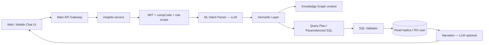

# AI Analytics Chatbot — Phase 10 Plan

**Roadmap phase:** [08-clone-roadmap.md](./08-clone-roadmap.md) **Phase 10** (10A–10F)  
**Status:** **10A + 10B complete** — scaffold, admin config, semantic layer v0. **10C–10F** pending.  
**Priority:** After MVP go-live + sales reports P0 (Month 8–10)  
**Does NOT block:** MR journey P0, Phase 6 go-live

> All future chatbot work is tracked **only** in this document and Phase 10 sub-phases. Do not add chatbot tasks to Phase 5/6 or MR P0 unless explicitly reprioritized.

---

## Phase 10 at a glance

| Sub-phase | Name | Status |
|-----------|------|--------|
| **10A** | Scaffold + admin config | **Done** |
| **10B** | Semantic layer (metrics → SQL templates) | Pending |
| **10C** | Knowledge graph v0 | Pending |
| **10D** | Chat UI + NL query pipeline | Pending |
| **10E** | Hardening (audit, mobile, MR scope) | Pending |
| **10F** | Field AI (voice DCR, OCR, briefs) | Pending |

---

## 1. Goal

Managers and admins ask **natural-language questions** about field force data:

- "Last month ka POB target vs achievement kya tha RM Mumbai ke liye?"
- "Kaun se doctors 30 din se visit nahi hue?"
- "MR Rahul ki coverage % is week?"

Answers must be **accurate, tenant-scoped (`compCode`), read-only**, and auditable — not hallucinated numbers.

---

## 2. Recommended architecture (your approach — validated)

Your stack is **correct for analytics NL queries**. We refine it so the LLM never runs arbitrary SQL.



### Layer responsibilities

| Layer | Purpose | MVP implementation | Later |
|-------|---------|---------------------|-------|
| **Knowledge Graph** | Entity relationships (MR→HQ→Route→Doctor→DCR→POB) | Postgres views + adjacency tables from Prisma schema | Neo4j / Apache AGE if graph queries dominate |
| **Semantic Layer** | Business metrics — "POB", "coverage %", "missed calls" — not raw column names | YAML/TS metric definitions mapping to approved SQL templates | dbt metrics / Cube.dev |
| **LLM** | Parse intent → metric + dimensions + filters; narrate results | OpenAI / Gemini via port adapter | Fine-tuned small model for intent only |
| **SQL Validation** | Block destructive SQL, enforce `compCode`, table allowlist, row limits | `node-sql-parser` + policy engine | Same + query cost estimator |

### Critical rule (non-negotiable)

**LLM does NOT write free-form SQL.**

Flow:

1. LLM outputs structured intent: `{ metric: "pob_achievement", dimensions: ["rm"], filters: { month: "2026-05" } }`
2. Semantic layer resolves intent → **pre-approved template** with bound parameters
3. SQL validator checks final SQL
4. Read-only DB user executes
5. LLM optionally summarizes rows (numbers come from DB only)

This avoids the #1 failure mode of "Text-to-SQL" chatbots in enterprise (wrong joins, missing `compCode`, leaked cross-tenant data).

---

## 3. Separate service — why and how

| Concern | Main `apps/api` | `apps/insights-service` |
|---------|-----------------|-------------------------|
| Scaling | Transactional CRUD, approvals | Bursty LLM + heavy reads |
| Security boundary | Write access | **Read-only** DB role |
| Extraction | Monolith module | Already a deployable unit |
| Failure isolation | API down = app down | Chat down ≠ DCR submit broken |

**Integration today:**

- Web/mobile call **main API** → `POST /api/v1/insights/chat` (proxy) OR direct to insights service with same JWT
- Insights service validates JWT (shared secret / JWKS), extracts `compCode`, `userId`, role
- No Prisma writes from insights service

**Future split:** Deploy `insights-service` as its own container (port 3010); same contract.

Scaffold location: `apps/insights-service/` (not `apps/api/src/modules/ai/`).

---

## 4. What we are NOT doing (yet)

| Approach | Verdict |
|----------|---------|
| Pure RAG on PDFs/docs | Good for **policy/help** chat, not for **numeric reports** |
| LLM → raw SQL | **Reject** — too risky for multi-tenant pharma data |
| Embedding entire DB in vector store | Stale data; use semantic layer on live read replica |
| Python sidecar (initial) | Defer unless custom ML (forecasting) — Node + LLM APIs enough for v1 |

**Two chatbots later (optional):**

1. **Analytics agent** (this doc) — numbers, reports, KPIs  
2. **Help agent** (RAG on docs + i18n) — "DCR kaise submit karein?"

Keep them separate modules inside `insights-service` or split in v2.

---

## 5. Phased delivery (maps to roadmap Phase 10)

### Phase 10A — Scaffold + admin config ✅ Done

- [x] `apps/insights-service` — health, chat stub, port interfaces
- [x] **Admin UI** — `Admin → AI Chatbot Settings` (`ADM05`) — API key, model, prompts
- [x] **Backend** — `insights_chat_configs` table, encrypted API key, internal config API
- [x] **Configurable LLM** — OpenAI/Gemini adapter reads admin config
- [x] Sidebar menu refresh on dashboard load
- [ ] OpenAPI stub for `POST /insights/chat`
- [ ] Docker profile `insights` (optional)

**Not in 10A:** Chat UI for end users, SQL execution, real analytics answers.

### Phase 10B — Semantic layer v0 (Month 8) ✅ Done

**Depends on:** Phase 8 / sales P0 reports stable (Sales Summary, Target vs Achievement, Visit Summary, Missed Calls).

- [x] 8 metrics in `apps/insights-service/src/semantic-definitions/metrics.ts`
- [x] `SemanticLayerAdapter` + `SemanticSqlValidatorAdapter` (tenant filter enforced)
- [x] Unit tests: every template injects `:compCode`
- [ ] Query executor + read-only DB user (Phase 10D)

### Phase 10C — Knowledge graph v0 (Month 8–9)

- Materialized views or nightly job:
  - `kg_employee_hierarchy` (reports_to chain)
  - `kg_doctor_route` (doctor on route, last_visit_date)
  - `kg_mr_activity` (dcr/pob links)
- Graph used to **enrich intent** ("my team" → resolve MR ids under RM)

No Neo4j until graph traversal queries exceed SQL comfort.

### Phase 10D — Chat UI + NL query pipeline (Month 9–10)

- Main API proxy → `insights-service`
- Chat modal on **Manager + Management dashboards**; Admin can use same UI
- SQL validator: SELECT-only, allowlist tables/views, max 10k rows, mandatory `comp_code`
- Read-only DB user `insights_ro`
- Audit log: question, intent, SQL hash, row count, userId, compCode

### Phase 10E — Hardening (Month 10+)

- MR-scoped chat (own data only)
- Mobile chat sheet (optional)
- Per-user rate limits; PII masking in narration

### Phase 10F — Field AI (Month 10+, optional)

From [17-FINAL-BUILD-PLAN.md](./17-FINAL-BUILD-PLAN.md) §9 — may live in main API + worker or insights:

- Voice → DCR (Whisper)
- Pre-call doctor brief (KG + semantic layer)
- Receipt OCR
- Manager approval summary

---

## 6. When to start (decision)

| Milestone | Start insights work? |
|-----------|---------------------|
| MR journey P0 incomplete | **No** — only 10A (done) |
| MVP go-live done, sales reports live | **Yes** — start **10B** semantic layer |
| Stable `compCode` RLS everywhere | **Required before 10D** |
| Read replica available | **Required before prod 10D** |

**Recommendation:** **10A done.** Next coding = **10B** after `docs/24-MR-JOURNEY-SALES-PRIORITIES.md` sales P0 + go-live.

---

## 7. Security checklist

- [ ] Dedicated DB user: `insights_ro` — SELECT only on allowlisted views
- [ ] JWT required; `compCode` from token, never from client body alone
- [ ] Role-based metric access (MR sees own data; RM sees team; admin sees company)
- [ ] Rate limit per user (stricter than main API)
- [ ] PII masking in narrated text (doctor phone, etc.)
- [ ] Full audit trail for compliance (pharma)
- [ ] No LLM training on customer data (API zero-retention policy)

---

## 8. API contract (draft)

```
POST /api/v1/insights/chat
Authorization: Bearer <jwt>

{
  "message": "Last month POB achievement for my team",
  "locale": "hinglish",
  "conversationId": "optional-uuid"
}

→ 200
{
  "answer": "Aapki team ka POB achievement 87% tha...",
  "data": { "rows": [...], "metric": "pob_achievement_pct" },
  "sources": ["semantic:pob_achievement_pct", "kg:employee_hierarchy"],
  "confidence": "high"
}
```

Errors: `400` bad intent, `403` metric not allowed, `422` validation failed, `501` not implemented (scaffold).

---

## 9. File layout (target)

```
apps/insights-service/
  src/
    modules/
      chat/           # HTTP orchestration
      semantic-layer/ # Metric definitions + resolver
      knowledge-graph/ # Entity context provider
      nl-query/       # Intent parsing
      sql-validator/  # Policy engine
    ports/            # Interfaces (testable)
    infrastructure/   # LLM adapters, DB reader
    config/
  semantic-definitions/  # YAML metrics (Phase 10B)
```

---

## 10. Related docs

| Doc | Link |
|-----|------|
| Roadmap Phase 10 | [08-clone-roadmap.md](./08-clone-roadmap.md) |
| Original AI notes | [17-FINAL-BUILD-PLAN.md](./17-FINAL-BUILD-PLAN.md) §9 |
| Current P0 | [24-MR-JOURNEY-SALES-PRIORITIES.md](./24-MR-JOURNEY-SALES-PRIORITIES.md) |
| Dev standards (ports) | [18-DEVELOPMENT-STANDARDS.md](./18-DEVELOPMENT-STANDARDS.md) §8 |
| Service README | [apps/insights-service/README.md](../apps/insights-service/README.md) |

---

## 12. Sales suggestions (rule engine) — Phase 9.5

**Not LLM.** Deterministic rules on top of report APIs / shared SQL.

| Rule example | Input metric | Suggested action |
|--------------|--------------|------------------|
| Low coverage | `coverage_pct < 70` | Show missed doctors (REP22) |
| High visits, low POB | visits ↑, achievement ↓ | “POB conversion focus” |
| Multi-device login | ADM06 flag | Security review |

**Deliverable:** `SalesInsightsService` + manager dashboard cards.  
**Start when:** REP22 + manager KPI tiles shipped.  
**Then:** 10B semantic layer reuses same metric definitions for chat.

---

## 13. Summary for stakeholders

| Question | Answer |
|----------|--------|
| Approach sahi hai? | **Haan** — with **template SQL**, not raw LLM SQL |
| Alag service? | **Haan** — `insights-service`, extractable later |
| Abhi full build? | **Nahi** — 10A done; **9.5 rules** then **10B–10D** after all sales reports |
| Kab start 10B? | **After** Missed Calls + manager KPIs + optional 9.5 rules |
| Kya naya karein? | Optional help-bot (RAG) separate from analytics agent |
